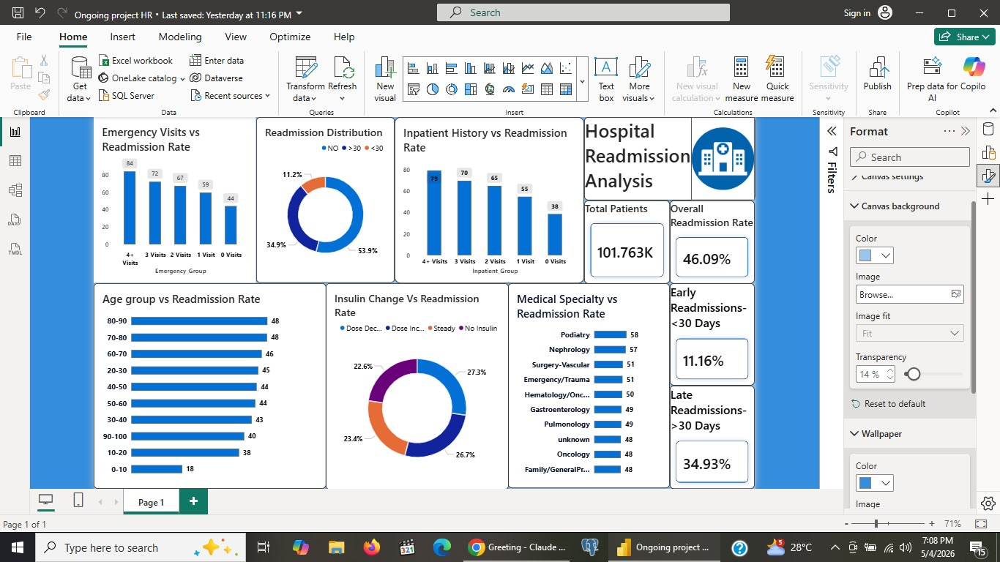

# Hospital Readmission Analytics

<p align="center">
  <strong>A production-minded healthcare analytics dataset focused on diabetic patient encounters, utilization patterns, treatment changes, and readmission outcomes.</strong>
</p>

<p align="center">
  
  
  
  
</p>

## Overview

This repository contains a structured hospital encounter dataset for diabetic patients, prepared for analytics, reporting, and predictive modeling workflows. The data captures patient demographics, admission context, inpatient utilization, diagnosis fields, medication activity, and readmission outcomes.

The project is well-suited for:

- readmission risk analysis
- patient segmentation
- treatment pattern exploration
- hospital operations reporting
- feature engineering and machine learning baselines

## Dataset Snapshot

| Metric | Value |
|---|---:|
| Records | 101,763 |
| Features | 47 |
| File | `diabetic_data_fixed.csv` |
| Granularity | One row per hospital encounter |
| Primary outcome | `readmitted` |

### Target Distribution

| Readmission Class | Count | Share |
|---|---:|---:|
| `NO` | 54,861 | 53.91% |
| `>30` | 35,545 | 34.93% |
| `<30` | 11,357 | 11.16% |

This distribution makes the dataset useful for both multiclass classification and business-focused reframing into binary outcomes such as "readmitted within 30 days" vs "not readmitted within 30 days."

## Repository Structure

```text
Hospital/
|-- assets/
|   `-- dashboard-overview.jpeg
|-- diabetic_data_fixed.csv
`-- README.md
```

## Dashboard Preview

The project also includes a business-style dashboard view that turns the raw dataset into an executive-friendly readmission story. This is useful for showing not only data handling ability, but also the ability to communicate findings clearly to non-technical stakeholders.



### What The Dashboard Highlights

- overall patient volume at `101.763K`
- overall readmission rate at `46.09%`
- readmissions within 30 days at `11.16%`
- late readmissions after 30 days at `34.93%`
- emergency and inpatient history as strong utilization signals
- age-group variation in readmission risk
- insulin change behavior and specialty-level performance patterns

### Why This Matters

This addition gives the repository a stronger end-to-end narrative:

- raw healthcare data
- structured analytical profiling
- outcome-focused business metrics
- clear visual communication for decision-makers

That combination makes the project feel more complete, more practical, and more representative of real analytics delivery work.

## Data Coverage

The dataset spans five major information areas:

### 1. Patient And Encounter Identifiers

- `encounter_id`
- `patient_nbr`

These fields uniquely identify each encounter and patient record and are typically excluded from modeling features after integrity checks.

### 2. Demographics

- `race`
- `gender`
- `age`

This layer supports cohort analysis, fairness checks, population profiling, and age-banded utilization trends.

### 3. Admission And Utilization Signals

- `admission_type_id`
- `discharge_disposition_id`
- `admission_source_id`
- `time_in_hospital`
- `num_lab_procedures`
- `num_procedures`
- `num_medications`
- `number_outpatient`
- `number_emergency`
- `number_inpatient`
- `number_diagnoses`

These features are especially useful for operational reporting and predictive modeling because they capture both intensity of care and prior service utilization.

### 4. Clinical Diagnosis Fields

- `diag_1`
- `diag_2`
- `diag_3`

These columns can be used for disease grouping, comorbidity exploration, and diagnosis family aggregation.

### 5. Medication And Treatment Activity

The dataset includes diabetes-related medication indicators such as:

- `metformin`
- `repaglinide`
- `nateglinide`
- `chlorpropamide`
- `glimepiride`
- `glipizide`
- `glyburide`
- `pioglitazone`
- `rosiglitazone`
- `insulin`
- `change`
- `diabetesMed`

This makes the dataset valuable for investigating treatment adjustment patterns and their relationship to readmission outcomes.

## High-Value Descriptive Signals

### Population Profile

- `Female`: 53.76%
- `Male`: 46.24%
- Largest age band: `70-80` at 25.61%
- Next largest age bands: `60-70` at 22.09%, `50-60` at 16.96%, `80-90` at 16.90%

The population skews older, which is consistent with a clinically meaningful diabetes readmission use case.

### Encounter Utilization Patterns

- Most common length of stay: `3` days
- Length of stay range: `1` to `14` days
- `45.84%` of encounters recorded `0` procedures
- `83.55%` of encounters recorded `0` outpatient visits
- `88.81%` of encounters recorded `0` emergency visits
- `66.46%` of encounters recorded `0` inpatient visits

These patterns suggest a mix of first-time or low-history encounters alongside smaller but important high-utilization patient groups.

### Medication Indicators

- `77.00%` of encounters have `diabetesMed = Yes`
- `46.19%` of encounters show a treatment `change`
- `46.56%` of encounters have `insulin = No`
- `30.31%` of encounters have `insulin = Steady`

These signals provide a strong base for studying medication intensity, treatment stability, and readmission risk.

## Data Quality Notes

This dataset is strong enough for serious analysis, but responsible usage still requires explicit handling of missing and coded values.

### Most Significant Missingness

| Column | Missing / Placeholder Share |
|---|---:|
| `medical_specialty` | 49.08% |
| `payer_code` | 39.56% |
| `race` | 2.23% |
| `diag_3` | 1.40% |
| `diag_2` | 0.35% |
| `diag_1` | 0.02% |

### Practical Considerations

- `medical_specialty` and `payer_code` need a deliberate missing-value strategy before modeling.
- Identifier columns should be excluded from training features.
- Diagnosis fields may require normalization or grouping before downstream analysis.
- Categorical medication columns can benefit from consistent ordinal or one-hot encoding strategies.
- Readmission modeling should account for class imbalance, especially for the `<30` class.

## Recommended Analytics Workflow

1. Validate schema and check for duplicate encounters or duplicate patients.
2. Standardize placeholder values such as `unknown`.
3. Profile each categorical field for rare levels and consolidation candidates.
4. Engineer utilization features from outpatient, emergency, and inpatient history.
5. Group diagnosis codes into clinically meaningful families.
6. Convert medication states into model-friendly features.
7. Build baseline models for multiclass and binary readmission prediction.
8. Evaluate with precision, recall, F1, ROC-AUC, and confusion-matrix analysis.

## Example Questions This Dataset Can Answer

- Which utilization signals are most associated with readmission within 30 days?
- Does medication change correlate with reduced or increased readmission risk?
- How does length of stay vary by age group or admission source?
- Which demographic or clinical segments show the highest repeat-hospitalization patterns?
- Can a practical baseline model identify high-risk encounters early enough to support intervention?

## Getting Started

### Python

```python
import pandas as pd

df = pd.read_csv("diabetic_data_fixed.csv")

print(df.shape)
print(df["readmitted"].value_counts(normalize=True))
```

### Quick First Checks

```python
df.isna().sum().sort_values(ascending=False).head(10)
df["readmitted"].value_counts()
df[["time_in_hospital", "num_medications", "number_diagnoses"]].describe()
```

## Why This Project Stands Out

This repository is intentionally simple in structure and strong in analytical value. It presents a real-world healthcare dataset with enough scale, feature richness, and business relevance to support:

- executive reporting
- exploratory data analysis
- feature engineering practice
- end-to-end machine learning case studies
- portfolio-ready healthcare analytics work

It is the kind of dataset that rewards disciplined thinking: clear problem framing, careful treatment of missing values, and outcome-driven feature design.

## Suggested Next Steps

- add a notebook for exploratory data analysis
- create a cleaned feature store version of the CSV
- document diagnosis-code grouping logic
- train a baseline classifier for `<30` readmission risk
- add visualizations for age, length of stay, and medication change patterns

## File

- `diabetic_data_fixed.csv`: core dataset used for all analysis in this project

---

Built as a clean, analysis-ready foundation for healthcare data work, with emphasis on clarity, reproducibility, and professional presentation.
